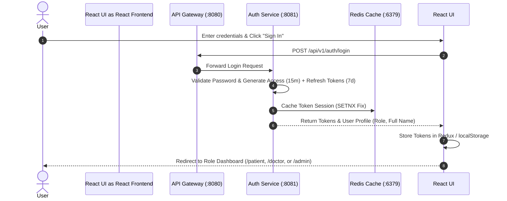
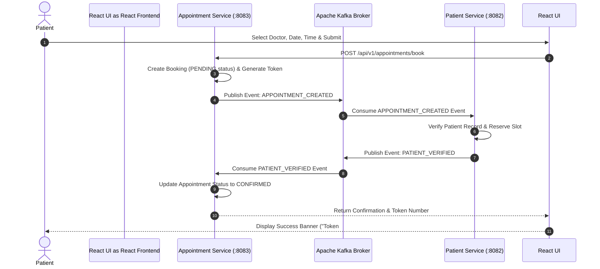
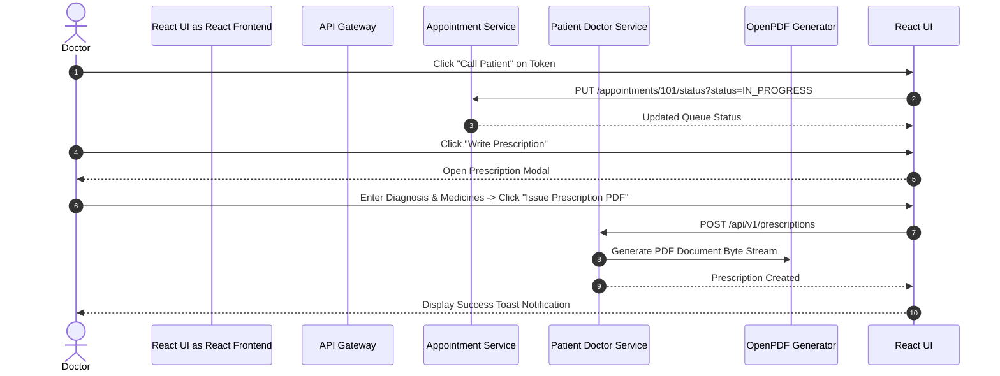
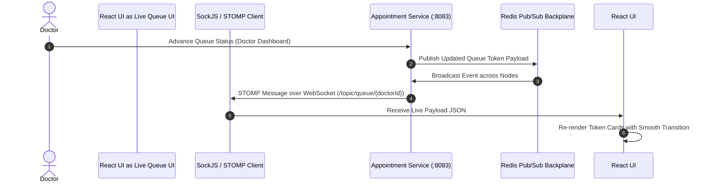
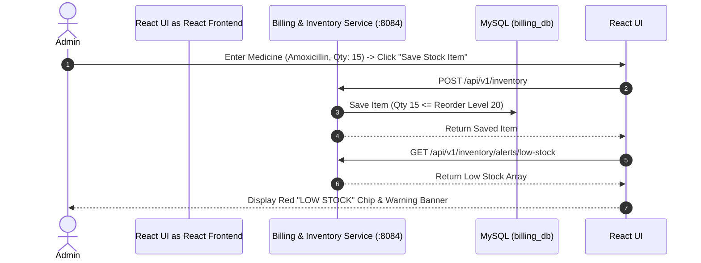

# Healthcare Management System — UX Flow & Demo Guide

> **Executive Overview**  
> This UX document provides a comprehensive, step-by-step guide for demonstrating the enterprise **Healthcare Management System**. It covers all **7 primary end-to-end user flows**, detailing UI/UX interactions, visual layout structures, backend microservices architecture, API endpoints, real-time WebSocket streams, Kafka Saga event orchestration, and exact **Demo Scripts** for a seamless live presentation.

---

## 📐 System UX Navigation Topology

```
                                +---------------------------+
                                |  http://localhost:3000   |
                                |     Login & Security      |
                                +-------------+-------------+
                                              |
                     +------------------------+------------------------+
                     |                        |                        |
                     v                        v                        v
        +-------------------------+ +-------------------+ +-------------------------+
        |   Patient Portal        | |   Doctor Portal   | |   Admin & Ops Portal    |
        |  /patient               | |  /doctor          | |  /admin                 |
        +------------+------------+ +---------+---------+ +------------+------------+
                     |                        |                        |
                     +------------------------+------------------------+
                                              |
                                              v
                                +---------------------------+
                                |   Live Queue Display      |
                                |  /queue (STOMP WebSockets)|
                                +---------------------------+
```

---

## 👥 User Personas & Role Matrix

| Persona | Role Key | Default Portal | Primary Capabilities |
| :--- | :--- | :--- | :--- |
| **Patient** | `ROLE_PATIENT` | `/patient` | Book appointments, view queue status, download OpenPDF prescriptions |
| **Doctor** | `ROLE_DOCTOR` | `/doctor` | Manage consultation queue, update patient status, issue digital prescriptions |
| **Administrator** | `ROLE_ADMIN` | `/admin` | Manage staff roster, track inventory & low-stock alerts, generate billing invoices |
| **Staff** | `ROLE_STAFF` | `/admin` | Operational support, stock updates, invoice PDF generation |

---

# 📑 UX Flows Specification

---

## 🔐 Flow 1: OAuth2 Authentication & Identity Management

### 1. Overview & User Goal
Allows users (Patients, Doctors, Admins, Staff) to register new accounts and securely sign into the Healthcare System using OAuth2 JWT authentication with Redis stampede protection.

### 2. Persona & Route
- **Persona**: All Personas  
- **Route**: `http://localhost:3000/login`

### 3. UI Layout & Visual Elements
- **Header**: Glassmorphism container with hospital emblem icon (`LocalHospitalIcon`) and subtitle: *"Healthcare System Portal — OAuth2 Secure Authentication Gateway"*.
- **Role Tabs**: Switchable tabs for `Sign In` and `Register`.
- **Form Controls**:
  - **Sign In**: Username field (default: `john_doe`), Password field (`password123`), gradient submit button.
  - **Register**: Full Name, Username, Email, Password, Phone Number, and User Role dropdown (`Patient`, `Doctor`, `Administrator`, `Staff`).
- **Feedback Elements**: Dynamic `Alert` components displaying error messages or registration success notifications.

### 4. Step-by-Step Interaction Sequence


### 5. Backend Microservice Data Flow
- **Service**: `auth-service` (Port 8081) via `api-gateway` (Port 8080)
- **Endpoints**:
  - `POST /api/v1/auth/login`
  - `POST /api/v1/auth/register`
  - `POST /api/v1/auth/refresh`
- **Security Logic**: Issues short-lived access JWTs (15 min) and long-lived refresh JWTs (7 days). Redux `authSlice` captures token states and Axios interceptors handle silent 401 token refresh.

### 6. Live Demo Script & Talking Points
> **Speaker Script:**  
> *"Welcome to our Healthcare Management Portal. Here we see our unified OAuth2 authentication flow. Users can toggle seamlessly between Sign In and Registration. Let me log in as a Patient. When I click Sign In, the Spring Gateway passes credentials to our Auth microservice, issuing a 15-minute JWT access token with a 7-day refresh token stored securely. Notice how the UI automatically redirects based on the user's assigned role."*

---

## 📅 Flow 2: Patient Appointment Booking & Kafka Saga Orchestration

### 1. Overview & User Goal
Enables patients to schedule medical consultations with specialized doctors. Submitting an appointment triggers a distributed transaction orchestrated via Apache Kafka Saga.

### 2. Persona & Route
- **Persona**: Patient (`ROLE_PATIENT`)  
- **Route**: `http://localhost:3000/patient`

### 3. UI Layout & Visual Elements
- **Layout**: 2-Column Responsive Layout.
- **Left Column — Booking Card**:
  - Doctor Roster Dropdown (shows specialization & consultation fee, e.g., *Dr. Sarah Jenkins - Cardiology ($150)*).
  - Date Picker (`Appointment Date`), Time Picker (`Appointment Time`), Reason Input.
  - Primary Action Button: `Schedule & Issue Token` (Gradient styled).
- **Right Column — Appointments & Prescriptions Table**:
  - Data Table showing Token Number (`#101`), Doctor Name, Date/Time, Status Chip (`CONFIRMED` / `PENDING`), Reason.
  - PDF Prescription Cards with download trigger.

### 4. Step-by-Step Interaction Sequence


### 5. Backend Microservice Data Flow
- **Service**: `appointment-service` (Port 8083) & `patient-doctor-service` (Port 8082)
- **Endpoints**:
  - `GET /api/v1/doctors`
  - `POST /api/v1/appointments/book`
  - `GET /api/v1/appointments/patient/{id}`
- **Resilience & Saga Patterns**: Microservices communicate asynchronously via Kafka topics (`appointment-events`). Idempotency is enforced to prevent double-booking.

### 6. Live Demo Script & Talking Points
> **Speaker Script:**  
> *"Now we are in the Patient Portal. Let's schedule an appointment with Dr. Sarah Jenkins for Cardiology. I fill in the appointment date and reason, then click 'Schedule & Issue Token'. Behind the scenes, our system initiates a Kafka Saga Orchestration workflow. The Appointment Service creates a pending record and emits an event to Kafka. The Patient Service consumes it, verifies patient availability, and completes the transaction. As you see, Token #101 is instantly assigned and displayed with a green CONFIRMED status."*

---

## 👨‍⚕️ Flow 3: Doctor Clinical Workflow & Digital Prescription Engine

### 1. Overview & User Goal
Allows doctors to view their daily consultation queue, manage patient appointments (`IN_PROGRESS`, `COMPLETED`), and issue official digital prescriptions exported via OpenPDF.

### 2. Persona & Route
- **Persona**: Doctor (`ROLE_DOCTOR`)  
- **Route**: `http://localhost:3000/doctor`

### 3. UI Layout & Visual Elements
- **Consultation Queue Table**:
  - Columns: Token # (Large bold text e.g. `#101`), Patient Name, Time Slot, Status Chip, Reason, Actions.
  - Action Buttons: `Call Patient` (Blue info button), `Complete` (Green success button with check icon), `Write Prescription` (Outlined icon button).
- **Prescription Modal Dialog**:
  - Modal Header: *"Issue Prescription for [Patient Name]"*.
  - Inputs: `Diagnosis`, `Prescribed Medicines & Dosage` (Multiline textarea), `Special Instructions`.
  - Actions: `Cancel` and `Issue Prescription PDF`.

### 4. Step-by-Step Interaction Sequence


### 5. Backend Microservice Data Flow
- **Service**: `patient-doctor-service` (Port 8082)
- **Endpoints**:
  - `GET /api/v1/appointments/doctor/{doctorId}?date={today}`
  - `PUT /api/v1/appointments/{id}/status?status=IN_PROGRESS|COMPLETED`
  - `POST /api/v1/prescriptions`
  - `GET /api/v1/prescriptions/{id}/pdf`
- **PDF Engine**: OpenPDF dynamically builds standard medical header layout, patient demographics, medication table, and digital authorization watermark.

### 6. Live Demo Script & Talking Points
> **Speaker Script:**  
> *"Switching to the Doctor Clinical Portal, Dr. Jenkins can view today's consultation queue. When Dr. Jenkins clicks 'Call Patient', the status changes to IN_PROGRESS. After examining the patient, clicking 'Write Prescription' opens our clinical editor. Once submitted, the backend invokes OpenPDF to render a standardized PDF document available for instant download in the Patient Portal."*

---

## 📡 Flow 4: Real-Time STOMP WebSocket Live Queue Tracking Stream

### 1. Overview & User Goal
Provides a real-time public display for patients in hospital waiting areas, showing live serving tokens, next upcoming tokens, and total waiting patients broadcasted over WebSockets.

### 2. Persona & Route
- **Persona**: All Users & Public Waiting Display  
- **Route**: `http://localhost:3000/queue`

### 3. UI Layout & Visual Elements
- **Status Header**: Displays live connection status chip (`Live WebSocket Active` with animated pulse indicator).
- **Roster Selector**: Dropdown to select doctor roster (e.g. *Dr. Sarah Jenkins*, *Dr. Robert Chen*).
- **3 Metric Display Cards**:
  - **CURRENT SERVING TOKEN**: High contrast blue banner showing `#4`.
  - **NEXT UPCOMING TOKEN**: Teal banner showing `#5`.
  - **TOTAL PATIENTS IN QUEUE**: Amber banner showing `12`.
- **Simulation Control**: `Advance Consultation Queue Token` button for demo testing.

### 4. Step-by-Step Interaction Sequence


### 5. Backend Microservice Data Flow
- **Service**: `appointment-service` (Port 8083) with STOMP WebSocket broker (`/ws-token`)
- **Topic Subscription**: `/topic/queue/{doctorId}`
- **WebSockets Architecture**: Uses `@stomp/stompjs` + `sockjs-client` with automatic 5-second reconnect handling and heartbeat pings.

### 6. Live Demo Script & Talking Points
> **Speaker Script:**  
> *"Here is our Real-Time Token Queue Stream. This screen is designed for hospital waiting lobby displays. Notice the green pulse showing an active STOMP WebSocket connection to port 8083. Watch what happens when a doctor calls the next patient: the WebSocket publishes the message, and the Current Serving Token updates instantly from #4 to #5 with zero page refresh!"*

---

## 🏛 Flow 5: Hospital Administration & Staff Roster Management

### 1. Overview & User Goal
Allows hospital administrators to add staff members, track staff designations across clinical departments, and manage monthly compensation rosters.

### 2. Persona & Route
- **Persona**: Administrator (`ROLE_ADMIN`)  
- **Route**: `http://localhost:3000/admin` (Tab 1: Staff Roster)

### 3. UI Layout & Visual Elements
- **Navigation Tabs**: Switchable tabs for `Staff Roster`, `Inventory & Medicines`, and `Billing & PDF Invoices`.
- **Left Panel — Add Staff Form**:
  - Inputs: `Full Name`, `Designation`, `Department`, `Monthly Salary ($)`.
  - Button: `Add Staff` (Gradient fill).
- **Right Panel — Current Staff Table**:
  - Columns: ID (`#1`), Name, Designation, Department, Salary (`$5000` highlighted in green).

### 4. Step-by-Step Interaction Sequence
1. Admin navigates to `/admin` and selects the **Staff Roster** tab.
2. Fills in staff details (e.g. *Dr. Alan Grant*, *Senior Surgeon*, *Cardiology*, *$12,000*).
3. Clicks **Add Staff**.
4. React app sends a `POST` request to `/api/v1/staff`.
5. Database persists record; table automatically re-fetches and displays new staff row.

### 5. Backend Microservice Data Flow
- **Service**: `billing-inventory-service` (Port 8084)
- **Endpoints**:
  - `GET /api/v1/staff`
  - `POST /api/v1/staff`

### 6. Live Demo Script & Talking Points
> **Speaker Script:**  
> *"In the Admin Portal under Staff Roster, administrators can onboard hospital personnel across departments such as Cardiology, Neurology, and Surgery. Let's add a new staff member. Submitting the form writes directly to our Billing & Inventory service, instantly updating our active roster."*

---

## 💊 Flow 6: Medical Inventory Control & Automated Low Stock Alerts

### 1. Overview & User Goal
Tracks medicine and surgical supply inventory in real-time and triggers automatic **Low Stock Warning Alerts** whenever stock levels drop below reorder thresholds.

### 2. Persona & Route
- **Persona**: Administrator / Staff (`ROLE_ADMIN`, `ROLE_STAFF`)  
- **Route**: `http://localhost:3000/admin` (Tab 2: Inventory & Medicines)

### 3. UI Layout & Visual Elements
- **Warning Alert Banner**: Amber alert box highlighting *"Low Stock Warning: X items below reorder threshold!"* when items trigger alert criteria.
- **Left Panel — Add Inventory Item**:
  - Inputs: `Item Name`, `Category`, `Quantity`, `Unit Price ($)`.
- **Right Panel — Inventory Table**:
  - Columns: Item Name, Category, Quantity, Unit Price, Stock Status Chip (`IN STOCK` green chip vs `LOW STOCK` red error chip).

### 4. Step-by-Step Interaction Sequence


### 5. Backend Microservice Data Flow
- **Service**: `billing-inventory-service` (Port 8084)
- **Endpoints**:
  - `GET /api/v1/inventory`
  - `POST /api/v1/inventory`
  - `GET /api/v1/inventory/alerts/low-stock`

### 6. Live Demo Script & Talking Points
> **Speaker Script:**  
> *"Next is Inventory Control. Maintaining pharmaceutical stock is critical. Here, each item has a configurable reorder threshold. If stock falls below this level—for instance, if we add Amoxicillin with a quantity of 15—the system automatically highlights the row with a red 'LOW STOCK' badge and triggers a top-level alert for hospital procurement."*

---

## 🧾 Flow 7: Financial Billing Ledger & PDF Invoice Receipts

### 1. Overview & User Goal
Enables administrators to generate patient billing invoices incorporating breakdown of consultation fees, medicine charges, and lab tests, with full OpenPDF invoice download functionality.

### 2. Persona & Route
- **Persona**: Administrator / Staff (`ROLE_ADMIN`)  
- **Route**: `http://localhost:3000/admin` (Tab 3: Billing & PDF Invoices)

### 3. UI Layout & Visual Elements
- **Left Panel — Invoice Generator Form**:
  - Inputs: `Consultation Fee ($)`, `Medicine Charges ($)`, `Lab Test Charges ($)`.
  - Button: `Issue Invoice Receipt`.
- **Right Panel — Billing Ledger Table**:
  - Columns: Invoice # (`#INV-1`), Patient Name, Total Amount (`$290.00` in bold text), Payment Status (`PAID` green chip), Action Button (`Invoice PDF` red outlined button).

### 4. Step-by-Step Interaction Sequence
1. Admin opens **Billing & PDF Invoices** tab.
2. Enters consultation fee ($150), medicine charges ($45), and lab test charges ($80).
3. Clicks **Issue Invoice Receipt**.
4. System computes tax ($15) and total ($290), creates an invoice record in `billing_db`.
5. Clicking **Invoice PDF** opens a secure new tab rendering the OpenPDF receipt with itemized charges.

### 5. Backend Microservice Data Flow
- **Service**: `billing-inventory-service` (Port 8084)
- **Endpoints**:
  - `POST /api/v1/billing/invoices`
  - `GET /api/v1/billing/invoices/patient/{patientId}`
  - `GET /api/v1/billing/invoices/{id}/pdf`

### 6. Live Demo Script & Talking Points
> **Speaker Script:**  
> *"Finally, we have the Billing Ledger. Administrators can input itemized charges for consultation, pharmacy, and laboratory services. Upon issuing an invoice, the system calculates taxes and totals. Clicking 'Invoice PDF' streams an official, branded PDF receipt built via OpenPDF through our Spring Cloud Gateway."*

---

## 🎯 Master Demo Execution Checklist

Before beginning your live presentation, follow this quick readiness checklist:

1. **Containers Running**: Verify Docker containers (`docker ps` -> MySQL, Redis, Kafka, Zipkin).
2. **Microservices Operational**:
   - Eureka Server (`http://localhost:8761`) — Verify all 5 microservices are registered.
   - API Gateway (`http://localhost:8080`) — Active.
   - React Frontend (`http://localhost:3000`) — Active.
3. **Demo Credentials**:
   - **Patient**: `john_doe` / `password123`
   - **Doctor**: `dr_jenkins` / `password123`
   - **Admin**: `admin_user` / `password123`
4. **Browser Tabs Prepared**:
   - Tab 1: `http://localhost:3000/login`
   - Tab 2: `http://localhost:3000/queue` (Public Waiting Display)
   - Tab 3: `http://localhost:8761` (Eureka Dashboard for technical architecture overview)
