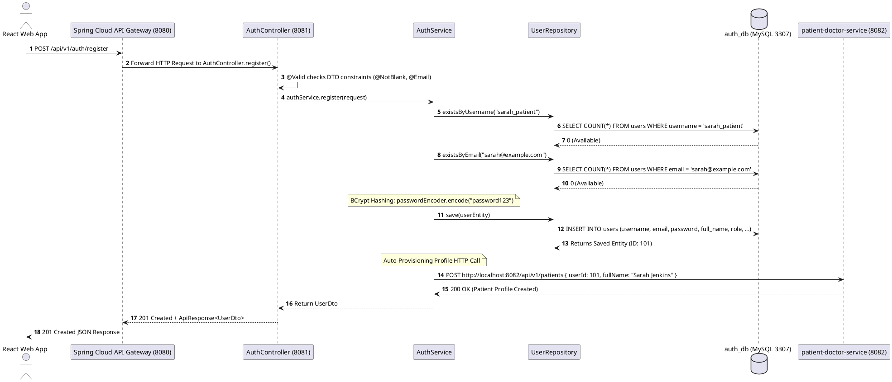
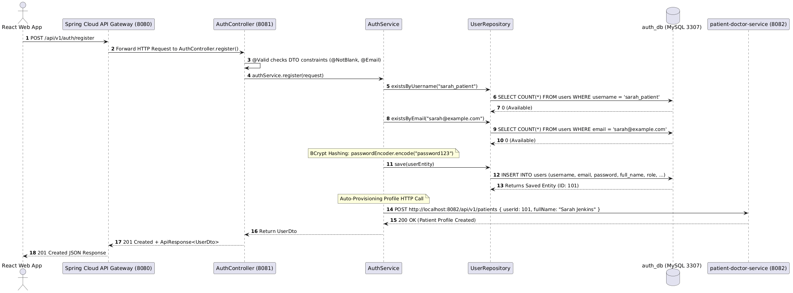
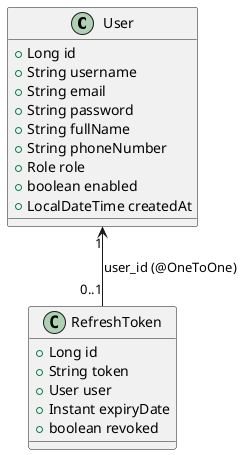
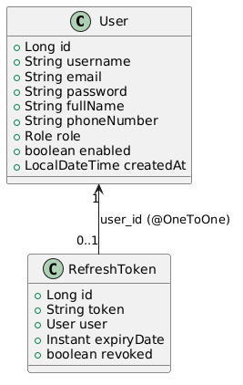
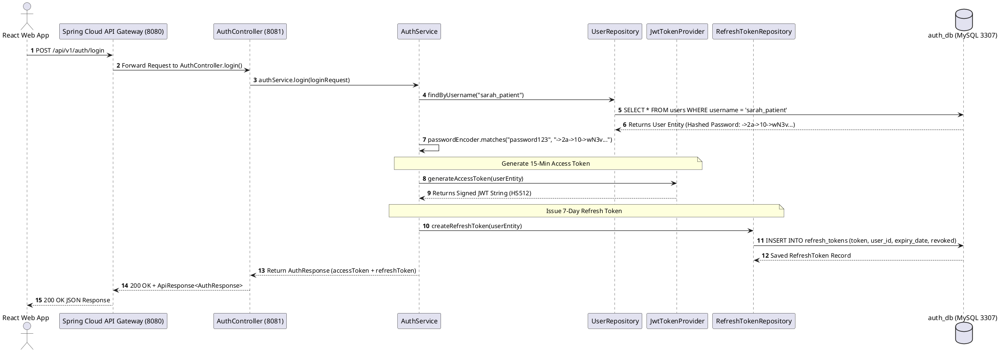
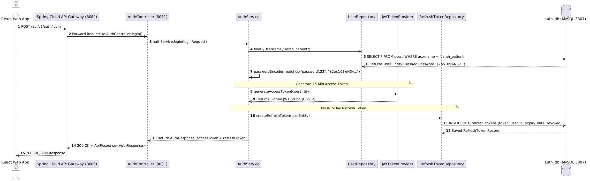

# 📚 Hands-On API Masterclass - Day 1
## Module: User Registration & Authentication Core (auth-service)
Welcome to **Day 1**! Today we dissect the two foundational security endpoints of our enterprise system:
1. POST /api/v1/auth/register — User Account Registration & BCrypt Password Hashing
2. POST /api/v1/auth/login — Authentication & Stateless JWT Access / Refresh Token Generation
---
# 🐣 SECTION 1: Layman Analogy vs. Backend Developer Analogy
Before inspecting the Java code, review how each core concept translates from real-world non-technical analogies into concrete backend software engineering terms:
| Concept / Technology | 🐣 Layman Analogy | 💻 Backend Developer Analogy & Technical Definition |
| **Jackson ObjectMapper & HTTP Converters** | A translator sitting between two diplomats. Translates spoken English (**JSON bytes**) into written shorthand (**Java Objects**) and back! | Spring MVC's `MappingJackson2HttpMessageConverter` wrapping `com.fasterxml.jackson.databind.ObjectMapper`. Converts raw HTTP JSON bytes into Java DTOs (`readValue()`) and Java objects into UTF-8 JSON responses (`writeValueAsString()`). |
| :--- | :--- | :--- |
| **API (Application Programming Interface)** | A restaurant menu and waiter. You select a dish (**Request**), the waiter delivers it to the kitchen (**Backend**), and brings back your meal on a tray (**Response**). | A stateless HTTP/REST contract defining URI resource paths (/api/v1/auth/register), methods (POST), headers (Content-Type), and JSON payloads over TCP. |
| **API Gateway & Microservices** | A hospital front-entrance security guard who checks visitor badges and directs people to specialized clinical departments. | A non-blocking Reverse Proxy & Edge Router (Spring Cloud Gateway on Netty) handling cross-cutting concerns (CORS, Rate Limiting, JWT validation) and routing traffic to autonomous Spring Boot services. |
| **DTO (Data Transfer Object) & Validation** | A pre-printed paper registration form checked by a receptionist. If a field is blank, it's handed back immediately. | Anemic POJO transfer objects annotated with @Valid, @NotBlank, @Email constraints validated by Hibernate Validator in Spring MVC before executing service logic. |
| **BCrypt Password Hashing** | A meat grinder. You put a steak in (**raw password**), and it outputs ground meat. You can never un-grind the meat back into a steak! | An adaptive key-derivation function based on the Blowfish cipher (BCryptPasswordEncoder) using a 128-bit random salt and configurable work factor to prevent rainbow table attacks. |
| **JWT Access Token** | A 15-minute stamped VIP wristband showing your name and access level. Every department checks your wristband without calling the main office. | A self-contained, digitally signed (HS512) stateless OAuth2 bearer token containing Base64URL encoded JSON claims (sub, userId, roles, exp) decoded locally by services without DB lookups. |
| **Refresh Token** | A 7-day VIP Membership Card used to obtain a new 15-minute wristband when the old wristband expires. | A stateful, database-persisted UUID token (refresh_tokens table) with expiration timestamps used for Token Rotation to issue fresh Access Tokens without forcing user re-authentication. |
| **Spring Data JPA & Hibernate** | A universal language interpreter translating spoken words into written foreign legal records. | An Object-Relational Mapping (ORM) abstraction layer implementing JPA specification to automatically translate Java Entity state changes into dialect-specific SQL (INSERT, SELECT, UPDATE). |
---
# 🌐 SECTION 2: API 1 - POST /api/v1/auth/register (User Account Registration)
---
## 1. End-to-End Request & Response Specification
### **HTTP Request**
- **Method**: POST
- **Path**: http://localhost:8080/api/v1/auth/register (routed via API Gateway to auth-service at http://localhost:8081)
- **Headers**:
```http
  Content-Type: application/json
  
```
- **Request Body JSON Payload**:
```json
  {
    "username": "sarah_patient",
    "email": "sarah@example.com",
    "password": "password123",
    "fullName": "Sarah Jenkins",
    "phoneNumber": "555-987-6543",
    "role": "ROLE_PATIENT"
  }
  
```
---
### **HTTP Response (Success - 201 Created)**
- **Headers**: Content-Type: application/json
- **Response Body JSON Payload**:
```json
  {
    "success": true,
    "message": "User registered successfully",
    "data": {
      "id": 101,
      "username": "sarah_patient",
      "email": "sarah@example.com",
      "fullName": "Sarah Jenkins",
      "phoneNumber": "555-987-6543",
      "role": "ROLE_PATIENT"
    },
    "timestamp": "2026-09-14T23:26:00.123"
  }
  
```
---
## 2. PlantUML Sequence Diagram (Architecture Flow)





---
## 3. Database Entity Relationship & Table Row Simulation
### **PlantUML Entity Relationship Diagram (Class Diagram)**





---
### **Database State Simulation (Before vs After API Execution)**
#### **BEFORE API Execution (auth_db.users Table)**
| id | username | email | password | full_name | phone_number | role | enabled | created_at |
|:---|:---|:---|:---|:---|:---|:---|:---|:---|
| 1 | john_doe | john@example.com | ->2a->10->e8X... | John Doe | 1234567890 | ROLE_PATIENT | 1 | 2026-09-01 10:00:00 |
---
#### **AFTER API Execution (auth_db.users Table)**
| id | username | email | password | full_name | phone_number | role | enabled | created_at |
|:---|:---|:---|:---|:---|:---|:---|:---|:---|
| 1 | john_doe | john@example.com | ->2a->10->e8X... | John Doe | 1234567890 | ROLE_PATIENT | 1 | 2026-09-01 10:00:00 |
| **101** | **sarah_patient** | **sarah@example.com** | **->2a->10->wN3vA8kL...** | **Sarah Jenkins** | **555-987-6543** | **ROLE_PATIENT** | **1** | **2026-09-14 23:26:00** |
> 🔒 **Notice**: Password "password123" was transformed into BCrypt Hash ->2a->10->wN3vA8kL...!
---
## 4. Code Dissection & Line-by-Line Annotations Walkthrough

### **A. DTO Class**: [`RegisterRequest.java`](file:///c:/Mamidi/2026/POC/hospital%20management/auth-service/src/main/java/com/hospital/auth/dto/RegisterRequest.java)

📌 **Purpose & Responsibility**:
The Data Transfer Object (DTO) defines the strict client-to-server HTTP payload contract. It acts as an isolation barrier between the public API surface and private database domain models, preventing security flaws like Mass Assignment vulnerabilities.

```java
public class RegisterRequest {

    @NotBlank(message = "Username is required")
    @Size(min = 3, max = 50, message = "Username must be between 3 and 50 characters")
    private String username;

    @NotBlank(message = "Email is required")
    @Email(message = "Invalid email format")
    private String email;

    @NotBlank(message = "Password is required")
    @Size(min = 6, message = "Password must be at least 6 characters")
    private String password;

    @NotBlank(message = "Full name is required")
    private String fullName;

    private String phoneNumber;

    @NotNull(message = "Role is required")
    private Role role;
}
```

🔬 **Detailed Line-by-Line & Annotation Breakdown**:
- `@NotBlank(message = "...")`: Hibernate Validator constraint checking that string fields are neither `null` nor trimmed empty whitespace (`""`). If violated, Spring's validation framework halts execution before reaching the Controller method.
- `@Size(min = 3, max = 50)`: Enforces field character boundaries. Prevents malicious long strings from causing database column overflow (`VARCHAR(50)` violation) or buffer exhaustion.
- `@Email(message = "Invalid email format")`: Validates that the input string conforms to RFC 5322 standard email format (`user@domain.com`).
- `@NotNull(message = "Role is required")`: Mandates that `role` must be a valid non-null Java `Role` enum constant (`ROLE_PATIENT`, `ROLE_DOCTOR`, `ROLE_ADMIN`, `ROLE_STAFF`).

---

### **B. Controller Layer**: [`AuthController.java`](file:///c:/Mamidi/2026/POC/hospital%20management/auth-service/src/main/java/com/hospital/auth/controller/AuthController.java#L22-L28)

📌 **Purpose & Responsibility**:
The REST Controller acts as the entry-point HTTP handler. It receives requests forwarded by Spring Cloud API Gateway, validates the incoming JSON payload using Jakarta Validation, delegates business processing to `AuthService`, and wraps results in standard REST response envelopes.

```java
22:     @PostMapping("/register")
23:     @Operation(summary = "Register a new User (Patient, Doctor, Admin, Staff)")
24:     public ResponseEntity<ApiResponse<UserDto>> register(@Valid @RequestBody RegisterRequest request) {
25:         UserDto registeredUser = authService.register(request);
26:         return ResponseEntity.status(HttpStatus.CREATED)
27:                 .body(ApiResponse.success("User registered successfully", registeredUser));
28:     }
```

🔬 **Detailed Line-by-Line & Annotation Breakdown**:
- `Line 22: @PostMapping("/register")`: Maps HTTP `POST` requests targeted at `/api/v1/auth/register` directly to this handler method.
- `Line 23: @Operation(...)`: Swagger / OpenAPI 3 annotation that documents endpoint capabilities for interactive API documentation generators.
- `Line 24: @Valid @RequestBody RegisterRequest request`:
  - `@RequestBody`: Instructs Spring MVC Jackson `ObjectMapper` to deserialize raw HTTP JSON body into a Java `RegisterRequest` object.
  - `@Valid`: Triggers Spring MVC Validator to evaluate all Jakarta Validation annotations (`@NotBlank`, `@Email`, `@Size`) on the request object. If validation fails, Spring throws `MethodArgumentNotValidException` (intercepted by Global Exception Handler to return HTTP `400 Bad Request`).
- `Line 25: UserDto registeredUser = authService.register(request)`: Hands off validated request object to service layer for transaction handling, hashing, and database persistence.
- `Lines 26-27: ResponseEntity.status(HttpStatus.CREATED)`: Constructs HTTP status `201 Created` response wrapped in standardized `ApiResponse<T>` JSON envelope containing payload metadata and timestamps.

---

### **C. Service Layer**: [`AuthService.java`](file:///c:/Mamidi/2026/POC/hospital%20management/auth-service/src/main/java/com/hospital/auth/service/AuthService.java#L34-L55)

📌 **Purpose & Responsibility**:
The Service Layer encapsulates enterprise business logic, transaction boundary management, password security hashing, domain entity construction, JPA repository persistence, and transformation into safe output DTOs.

```java
34:     @Transactional
35:     public UserDto register(RegisterRequest request) {
36:         if (userRepository.existsByUsername(request.getUsername())) {
37:             throw new IllegalArgumentException("Username is already taken");
38:         }
39:         if (userRepository.existsByEmail(request.getEmail())) {
40:             throw new IllegalArgumentException("Email is already registered");
41:         }
42: 
43:         User user = User.builder()
44:                 .username(request.getUsername())
45:                 .email(request.getEmail())
46:                 .password(passwordEncoder.encode(request.getPassword()))
47:                 .fullName(request.getFullName())
48:                 .phoneNumber(request.getPhoneNumber())
49:                 .role(request.getRole())
50:                 .enabled(true)
51:                 .build();
52: 
53:         User savedUser = userRepository.save(user);
54: 
55:         return mapToUserDto(savedUser);
56:     }
```

🔬 **Detailed Line-by-Line & Annotation Breakdown**:
- `Line 34: @Transactional`: Declares a Spring transaction boundary. Ensures database operations run inside an ACID-compliant transaction. If any runtime exception is thrown (e.g. database disconnect or downstream service failure), all SQL operations roll back automatically.
- `Lines 36-41: Duplicate Validation`: Executes optimized `SELECT COUNT(*)` queries via `userRepository.existsByUsername()` and `existsByEmail()`. If duplicate matches exist, throws `IllegalArgumentException` to halt registration.
- `Lines 43-51: User.builder()`: Utilizes Lombok Builder pattern to assemble domain entity.
  - `Line 46: passwordEncoder.encode(...)`: Key Security Step! Uses BCrypt algorithm with a 128-bit random salt to convert raw password `"password123"` into a non-invertible 60-character hash (`->2a->10->wN3v...`).
- `Line 53: userRepository.save(user)`: Passes domain entity to Spring Data JPA / Hibernate, executing SQL `INSERT INTO users (...)` statement and returning managed entity with generated auto-increment ID (`101`).
- `Line 55: mapToUserDto(savedUser)`: Transforms internal `User` entity into public `UserDto`, deliberately excluding sensitive fields like `password` hash from HTTP responses.
---
# 🔐 SECTION 3: API 2 - POST /api/v1/auth/login (Authentication & JWT Generation)
---
## 1. End-to-End Request & Response Specification
### **HTTP Request**
- **Method**: POST
- **Path**: http://localhost:8080/api/v1/auth/login
- **Headers**: Content-Type: application/json
- **Request Body JSON Payload**:
```json
  {
    "username": "sarah_patient",
    "password": "password123"
  }
  
```
---
### **HTTP Response (Success - 200 OK)**
- **Response Body JSON Payload**:
```json
  {
    "success": true,
    "message": "Login successful",
    "data": {
      "accessToken": "eyJhbGciOiJIUzUxMiJ9.eyJyb2xlcyI6IlJPTEVfUEFUSUVOVCIsInVzZXJJZCI6MTAxLCJlbWFpbCI6InNhcmFoQGV4YW1wbGUuY29tIiwic3ViIjoic2FyYWhfcGF0aWVudCIsImlhdCI6MTc4OTIzMzQ4NiwiZXhwIjoxNzg5MjM0Mzg2fQ.wX82kL9...",
      "refreshToken": "4a71b123-9876-4abc-8910-def123456789",
      "tokenType": "Bearer",
      "userId": 101,
      "username": "sarah_patient",
      "email": "sarah@example.com",
      "fullName": "Sarah Jenkins",
      "role": "ROLE_PATIENT"
    },
    "timestamp": "2026-09-14T23:26:10.456"
  }
  
```
---
## 2. PlantUML Sequence Diagram (Architecture Flow)





---
## 3. Database Entity Relationship & Table Row Simulation
### **Database State Simulation (Before vs After Login API Execution)**
#### **BEFORE Login Execution (auth_db.refresh_tokens Table)**
*(Empty table or no active refresh token for user 101)*
---
#### **AFTER Login Execution (auth_db.refresh_tokens Table)**
| id | token | user_id | expiry_date | revoked |
|:---|:---|:---|:---|:---|
| **1** | **4a71b123-9876-4abc-8910-def123456789** | **101** | **2026-09-21 23:26:10** | **0 (false)** |
> 🔗 **JPA @OneToOne Foreign Key Link**: Column user_id = 101 maps directly to User(id = 101) in auth_db.users!
---
## 4. Code Dissection & Line-by-Line Annotations Walkthrough

### **A. Controller Layer**: [`AuthController.java`](file:///c:/Mamidi/2026/POC/hospital%20management/auth-service/src/main/java/com/hospital/auth/controller/AuthController.java#L30-L35)

📌 **Purpose & Responsibility**:
Exposes the public authentication endpoint for user credentials verification. Receives `LoginRequest`, delegates credentials verification and token generation to `AuthService`, and returns standard `200 OK` HTTP response.

```java
30:     @PostMapping("/login")
31:     @Operation(summary = "Authenticate user and issue Access & Refresh tokens")
32:     public ResponseEntity<ApiResponse<AuthResponse>> login(@Valid @RequestBody LoginRequest request) {
33:         AuthResponse response = authService.login(request);
34:         return ResponseEntity.ok(ApiResponse.success("Login successful", response));
35:     }
```

🔬 **Detailed Line-by-Line & Annotation Breakdown**:
- `Line 30: @PostMapping("/login")`: Maps HTTP `POST` requests targeted at `/api/v1/auth/login`.
- `Line 32: @Valid @RequestBody LoginRequest request`: Deserializes JSON payload into `LoginRequest` object containing `username` and `password` fields, and validates constraints.
- `Line 33: AuthResponse response = authService.login(request)`: Invokes core authentication service logic.
- `Line 34: ResponseEntity.ok(...)`: Returns HTTP status `200 OK` wrapping `AuthResponse` DTO containing access token, refresh token, and user metadata.

---

### **B. Service Layer**: [`AuthService.java`](file:///c:/Mamidi/2026/POC/hospital%20management/auth-service/src/main/java/com/hospital/auth/service/AuthService.java#L90-L110)

📌 **Purpose & Responsibility**:
Performs password validation against database BCrypt hash, triggers JWT generation via `JwtTokenProvider`, creates persistent refresh token records, and builds the authentication response payload.

```java
90:     public AuthResponse login(LoginRequest request) {
91:         User user = userRepository.findByUsername(request.getUsername())
92:                 .orElseThrow(() -> new IllegalArgumentException("Invalid username or password"));
93: 
94:         if (!passwordEncoder.matches(request.getPassword(), user.getPassword())) {
95:             throw new IllegalArgumentException("Invalid username or password");
96:         }
97: 
98:         String accessToken = jwtTokenProvider.generateAccessToken(user);
99:         RefreshToken refreshToken = createRefreshToken(user);
100: 
101:        return AuthResponse.builder()
102:                 .accessToken(accessToken)
103:                 .refreshToken(refreshToken.getToken())
104:                 .userId(user.getId())
105:                 .username(user.getUsername())
106:                 .email(user.getEmail())
107:                 .fullName(user.getFullName())
108:                 .role(user.getRole().name())
109:                 .build();
110:     }
```

🔬 **Detailed Line-by-Line & Annotation Breakdown**:
- `Lines 91-92: UserRepository Lookup`: Fetches user domain record by username. If username does not exist, throws `IllegalArgumentException("Invalid username or password")`.
- `Lines 94-96: Password Matching`: Calls `passwordEncoder.matches(rawPassword, hashedPassword)`. Hashes the raw input password using BCrypt salt stored in the database string and compares it in **constant time** to defend against timing side-channel attacks.
- `Line 98: jwtTokenProvider.generateAccessToken(user)`: Calls JWT token provider to construct a signed stateless OAuth2 access token valid for 15 minutes.
- `Line 99: createRefreshToken(user)`: Generates a random UUID string, sets 7-day expiration timestamp, and persists a new record into `auth_db.refresh_tokens` table for token rotation support.
- `Lines 101-109: Response Construction`: Assembles `AuthResponse` DTO containing `accessToken`, `refreshToken`, user IDs, roles, and profile attributes.

---

### **C. JWT Token Provider**: [`JwtTokenProvider.java`](file:///c:/Mamidi/2026/POC/hospital%20management/auth-service/src/main/java/com/hospital/auth/security/JwtTokenProvider.java#L25-L42)

📌 **Purpose & Responsibility**:
Cryptographic utility class responsible for constructing, signing, parsing, and validating JSON Web Tokens (JWT) using HMAC SHA-512 symmetric secret keys.

```java
public String generateAccessToken(User user) {
    Instant now = Instant.now();
    Instant expiryDate = now.plusMillis(accessTokenExpirationMs);

    return Jwts.builder()
            .subject(user.getUsername())
            .claim("userId", user.getId())
            .claim("email", user.getEmail())
            .claim("roles", user.getRole().name())
            .issuedAt(Date.from(now))
            .expiration(Date.from(expiryDate))
            .signWith(key, Jwts.SIG.HS512)
            .compact();
}
```

🔬 **Detailed Line-by-Line & Annotation Breakdown**:
- `Lines 382-383: Timestamp Calculation`: Uses Java 8 `Instant.now()` to get epoch timestamps, setting token expiration to 15 minutes (`accessTokenExpirationMs`) in the future.
- `Lines 385-394: JJWT Builder Pipeline`:
  - `.subject(user.getUsername())`: Standard RFC 7519 `sub` claim identifying the token owner.
  - `.claim("userId", user.getId())` & `.claim("roles", ...)`: Embeds user ID and role claims directly in the Base64URL-encoded JWT payload. Allows API Gateway and downstream microservices to authorize incoming requests locally without querying the database!
  - `.issuedAt(...)` & `.expiration(...)`: Embeds standard `iat` (issued-at) and `exp` (expiration) timestamps.
  - `.signWith(key, Jwts.SIG.HS512)`: Signs header + payload with 512-bit HMAC secret key (`HS512`). Prevents tampering or forgery by malicious clients.
  - `.compact()`: Serializes header, payload claims, and signature into standard `Header.Payload.Signature` dot-separated JWT string.
---
## 🧠 5. Interview Questions & Code Answers
| Question | Candidate Answer for System Design Interviews |
| :--- | :--- |
| **Q1: Why separate Access Tokens and Refresh Tokens?** | *"Access Tokens are short-lived (15 mins) and stateless for high performance. If compromised, the window of vulnerability is tiny. Refresh Tokens are long-lived (7 days), stored securely in the database, and allow revoking access immediately if a user's account is compromised."* |
| **Q2: Why use BCrypt instead of MD5 or SHA-256 for password hashing?** | *"MD5 and SHA-256 are fast algorithms vulnerable to Rainbow Table and GPU brute-force attacks. BCrypt includes a cryptographic **salt** and a configurable **work factor** (cost parameter), making brute-force dictionary attacks computationally infeasible."* |
| **Q3: How do you prevent Username Enumeration security vulnerabilities during login?** | *"We return identical vague error messages ("Invalid username or password") for both non-existent usernames and incorrect passwords, preventing attackers from discovering valid user accounts."* |
---
### 🚀 Summary Checklist for Day 1
- [x] Standard PlantUML (@startuml ... @enduml) code blocks used exclusively.
- [x] Side-by-Side Layman Analogy vs. Backend Developer Analogy Comparison completed.
- [x] Full request-to-response sequence diagrams generated in PlantUML format.
- [x] Database state simulation (Before vs After API execution) completed.
- [x] Code dissected with exact line links across Controller, Service, DTO, and JWT Provider classes.