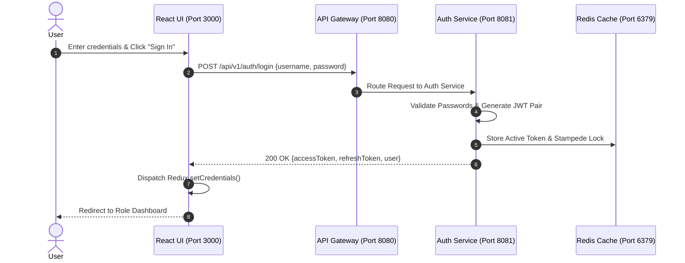

# Figma UX Flow 1: OAuth2 Authentication & Security Gateway

> **Figma Design Board ID**: `FIG-FLOW-01-AUTH`  
> **Route**: `http://localhost:3000/login`  
> **Primary Persona**: All Personas (`ROLE_PATIENT`, `ROLE_DOCTOR`, `ROLE_ADMIN`, `ROLE_STAFF`)

---

## 🎨 Figma Board Overview & Interaction Storyboard

This document provides a step-by-step UX walkthrough for the **OAuth2 Authentication & Security** flow. Users register accounts, submit credentials, and receive short-lived JWT Access Tokens (15 min) and long-lived Refresh Tokens (7 days) stored securely in Redux and local state.

```
+-----------------------------------------------------------------------------------+
|  STEP 1: Initial Login Page    --->   STEP 2: Registration Tab View               |
|  (Sign In Form & OAuth2 Logo)          (Full Name, Role Dropdown, Registration)   |
|                                                                                   |
|                                         v                                         |
|                                                                                   |
|  STEP 4: Active Session         <---   STEP 3: Auth Verification & JWT Issued     |
|  (Role Dashboard Redirection)          (Redux Store & Redis Token Cache)          |
+-----------------------------------------------------------------------------------+
```

---

## 📱 Step-by-Step UI Storyboard & Screen Layouts

### Step 1: Initial Login Page (Sign In Tab)
- **User Action**: User visits `http://localhost:3000/login`.
- **UI State**: Glassmorphism container centered on canvas. Tab `Sign In` is selected by default.
- **Inputs**: Username (`john_doe`), Password (`password123`).
- **Trigger**: Clicks `Sign In` gradient button.


#### Component Properties & Styling Tokens:
- **Card Container**: `background: rgba(30, 41, 59, 0.7); backdrop-filter: blur(16px); border: 1px solid #334155`
- **Primary Button**: `background: linear-gradient(90deg, #0284c7, #0d9488); border-radius: 8px`
- **Typography**: Inter Sans-Serif, 700 bold title, `#94a3b8` muted text.

---

### Step 2: Registration Tab View
- **User Action**: Clicks on `Register` tab.
- **UI State**: Form dynamically switches to Registration fields.
- **Inputs**: Full Name, Username, Email, Password, Phone Number, User Role Dropdown.
- **Role Selection Options**: `Patient`, `Doctor`, `Administrator`, `Staff`.
- **Trigger**: Clicks `Register Account` button.


---

### Step 3: Auth Verification & JWT Session Issued
- **Backend Flow**:
  1. `POST /api/v1/auth/login` processed by `auth-service` via `api-gateway` (Port 8080).
  2. Access token (15 mins) and refresh token (7 days) generated.
  3. Session saved in Redis cache with stampede protection (`SETNX` mutex).
- **UI State**: Redux `authSlice` captures `setCredentials`. Navbar re-renders showing logged-in user profile chip.


---

### Step 4: Role-Based Routing & Session Guard
- **Router Logic**:
  - `ROLE_PATIENT` -> Navigates to `/patient`
  - `ROLE_DOCTOR` -> Navigates to `/doctor`
  - `ROLE_ADMIN` / `ROLE_STAFF` -> Navigates to `/admin`

---

## 🛠 Microservice Data Flow Sequence



---

## 💬 Live Demo Script
> *"Here in Flow 1, we see our OAuth2 Authentication Gateway. When a user logs in, the request passes through Spring Cloud Gateway to our Auth service. Upon password validation, it issues a 15-minute JWT access token alongside a 7-day refresh token stored in Redis with cache stampede protection. Notice how the application instantly routes the user to their role-specific dashboard."*
