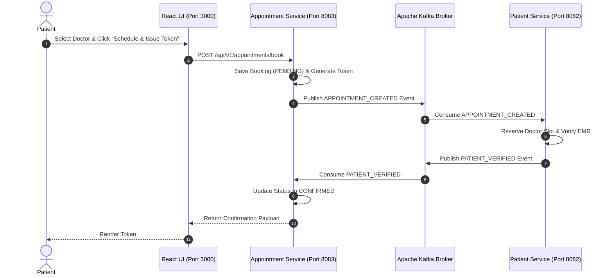

# Figma UX Flow 2: Patient Appointment Booking & Kafka Saga Orchestration

> **Figma Board ID**: `FIG-FLOW-02-PATIENT`  
> **Route**: `http://localhost:3000/patient`  
> **Primary Persona**: Patient (`ROLE_PATIENT`)

---

## 🎨 Figma Board Overview & Interaction Storyboard

This document covers the **Patient Appointment Booking** workflow. Patients select specialized doctors, date, time, and visit reasons. Submitting an appointment initiates an event-driven **Apache Kafka Saga Orchestration** distributed transaction across `appointment-service` and `patient-doctor-service`.

```
+-----------------------------------------------------------------------------------+
|  STEP 1: Doctor & Slot Selection   --->   STEP 2: Saga Transaction Initiated     |
|  (Roster Dropdown, Date/Time)             (Kafka Event Published & Processing)    |
|                                                                                   |
|                                         v                                         |
|                                                                                   |
|  STEP 4: Medical Prescription View <---   STEP 3: Token Assigned & Confirmed      |
|  (OpenPDF Download Links)                 (Token #101 with Green Chip Status)     |
+-----------------------------------------------------------------------------------+
```

---

## 📱 Step-by-Step UI Storyboard & Screen Layouts

### Step 1: Doctor & Slot Selection Form
- **User Action**: Patient navigates to `/patient`.
- **UI State**: Left column card titled `Book Appointment (Kafka Saga)`.
- **Inputs**:
  - `Select Doctor`: *Dr. Sarah Jenkins - Cardiology ($150)*
  - `Appointment Date`: `2026-09-10`
  - `Appointment Time`: `10:00:00`
  - `Reason / Symptoms`: *Routine Health Checkup*
- **Trigger**: Clicks `Schedule & Issue Token` button.


---

### Step 2: Kafka Saga Transaction Initiated
- **Backend Flow**:
  1. `appointment-service` (Port 8083) creates a record in `appt_db` in `PENDING` state and assigns Token `#101`.
  2. Publishes `APPOINTMENT_CREATED` event to Apache Kafka topic `appointment-events`.
  3. `patient-doctor-service` (Port 8082) consumes event, validates patient record, and publishes `PATIENT_VERIFIED`.
  4. `appointment-service` consumes verification and updates appointment status to `CONFIRMED`.


---

### Step 3: Token Assigned & Confirmed Table View
- **UI State**: Top banner displays `Chip` notification: *"Saga Event Initiated! Booked Appointment Token #101"*.
- **Appointments Table**:
  - `Token #`: `#101` (Cyan highlighted bold text)
  - `Doctor`: `Dr. Sarah Jenkins`
  - `Date & Time`: `2026-09-10 10:00:00`
  - `Status`: `CONFIRMED` (Green Chip)
  - `Reason`: `Routine Health Checkup`

---

### Step 4: Medical Prescriptions & OpenPDF Export Section
- **UI State**: Bottom right section titled `Medical Prescriptions (OpenPDF Export)`.
- **Cards**: Displays diagnosis, prescribed medicines, and red outline button `Download PDF` triggering:
  `GET http://localhost:8080/api/v1/prescriptions/{id}/pdf?token={jwt}`

---

## 🛠 Microservice Saga Workflow Sequence



---

## 💬 Live Demo Script
> *"In Flow 2, we demonstrate our event-driven Kafka Saga workflow. When a patient schedules an appointment, the Appointment Service emits an event to Kafka. The Patient Service consumes this event, validates the slot, and completes the distributed transaction without blocking the UI. Within milliseconds, Token #101 appears on screen with a green CONFIRMED status badge!"*
