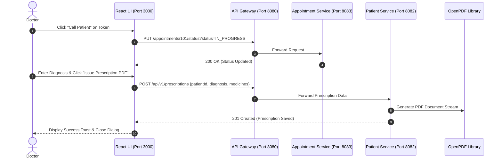

# Figma UX Flow 3: Doctor Clinical Consultation & Digital Prescription Engine

> **Figma Board ID**: `FIG-FLOW-03-DOCTOR`  
> **Route**: `http://localhost:3000/doctor`  
> **Primary Persona**: Doctor (`ROLE_DOCTOR`)

---

## 🎨 Figma Board Overview & Interaction Storyboard

This document detail the **Doctor Clinical Portal** workflow. Doctors view today's consultation queue, advance patient status (`IN_PROGRESS`, `COMPLETED`), and issue official digital prescriptions formatted and rendered via OpenPDF.

```
+-----------------------------------------------------------------------------------+
|  STEP 1: Doctor Consultation Queue --->   STEP 2: Call Patient & Status Update   |
|  (Token #101, Patient Name, Actions)     (Status changed to IN_PROGRESS)          |
|                                                                                   |
|                                         v                                         |
|                                                                                   |
|  STEP 4: OpenPDF Receipt Issued   <---   STEP 3: Digital Prescription Editor      |
|  (Streamed PDF Byte Stream to EMR)       (Diagnosis, Medicines & Instructions)    |
+-----------------------------------------------------------------------------------+
```

---

## 📱 Step-by-Step UI Storyboard & Screen Layouts

### Step 1: Doctor Consultation Queue View
- **User Action**: Doctor Jenkins logs in and navigates to `/doctor`.
- **UI State**: Full width glassmorphism table titled `Today's Consultation Patient Queue`.
- **Columns**: Token # (`#101`), Patient Name (`John Doe`), Time Slot (`10:00 AM`), Status (`CONFIRMED`), Reason (`Routine Checkup`), Actions.
- **Action Buttons**:
  - `Call Patient` (Blue info button)
  - `Complete` (Green success button with checkmark icon)
  - `Write Prescription` (Outlined icon button)


---

### Step 2: Call Patient & Status Update
- **User Action**: Doctor clicks `Call Patient` on Token `#101`.
- **Backend Flow**: Sends `PUT /api/v1/appointments/101/status?status=IN_PROGRESS` to `appointment-service`.
- **UI State**: Status Chip dynamically transitions to blue `IN_PROGRESS`.

---

### Step 3: Digital Prescription Editor Dialog Modal
- **User Action**: Doctor clicks `Write Prescription`.
- **UI State**: Modal dialog overlays dark portal backdrop titled *"Issue Prescription for John Doe"*.
- **Inputs**:
  - `Diagnosis`: *Hypertension / Chronic Cough*
  - `Prescribed Medicines & Dosage`: *Amoxicillin 500mg - 1 tab after meals twice daily (5 days)*
  - `Special Instructions`: *Drink plenty of water and rest.*
- **Trigger**: Clicks `Issue Prescription PDF` button.


---

### Step 4: OpenPDF Generation & Consultation Completion
- **Backend Flow**:
  1. `POST /api/v1/prescriptions` processed by `patient-doctor-service`.
  2. OpenPDF compiles standard medical header, doctor credentials, patient demographics, medication table, and digital watermark signature.
- **UI State**: Success toast chip appears: *"Prescription issued successfully for John Doe"*. Patient row status updated to green `COMPLETED`.

---

## 🛠 Microservice Data Flow Sequence



---

## 💬 Live Demo Script
> *"In Flow 3, Dr. Jenkins manages today's clinical consultations. Clicking 'Call Patient' changes the status to IN_PROGRESS. After examining the patient, Dr. Jenkins opens the digital prescription editor to enter medications and dosage. Submitting the form calls our OpenPDF engine on port 8082, rendering a standardized PDF document available instantly for patient download!"*
