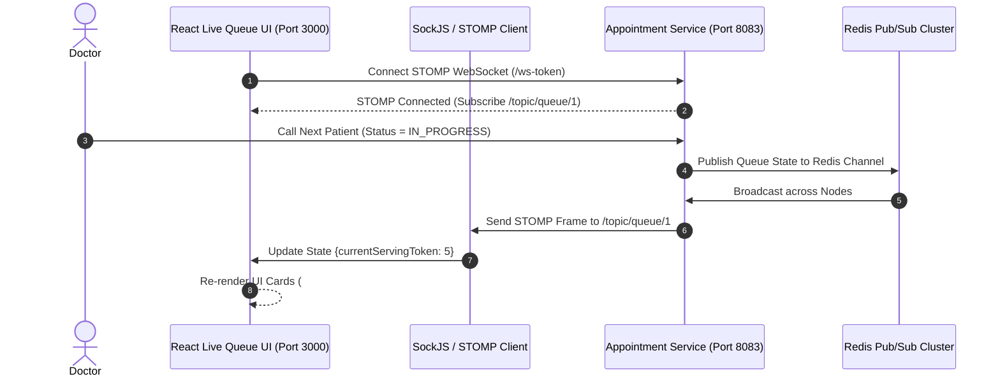

# Figma UX Flow 4: Real-Time STOMP Live Queue Token Stream

> **Figma Board ID**: `FIG-FLOW-04-QUEUE`  
> **Route**: `http://localhost:3000/queue`  
> **Primary Persona**: Public Display / Waiting Patients

---

## 🎨 Figma Board Overview & Interaction Storyboard

This document detail the **Real-Time Live Queue Token Stream** display designed for hospital lobby monitors. Using STOMP WebSockets connected to `appointment-service` over Redis Pub/Sub, live token updates transition instantly without page reloads.

```
+-----------------------------------------------------------------------------------+
|  STEP 1: STOMP Connection Active   --->   STEP 2: Live Metric Cards Display       |
|  (Live WebSocket Active Pulse)            (Current #4, Next #5, Waiting 12)       |
|                                                                                   |
|                                         v                                         |
|                                                                                   |
|  STEP 4: Smooth UI Transition     <---   STEP 3: Queue Advancement Broadcast      |
|  (Current Token becomes #5)              (STOMP Event /topic/queue/{doctorId})    |
+-----------------------------------------------------------------------------------+
```

---

## 📱 Step-by-Step UI Storyboard & Screen Layouts

### Step 1: STOMP WebSocket Connection Established
- **User Action**: Public display opens `http://localhost:3000/queue`.
- **WebSocket Protocol**: SockJS initiates connection to `http://localhost:8083/ws-token`. STOMP client subscribes to topic `/topic/queue/{doctorId}`.
- **UI State**: Top right chip glows with green animated pulse reading *"Live WebSocket Active"*.


---

### Step 2: Live Metric Cards Display
- **Card 1 — CURRENT SERVING TOKEN**: High-contrast cyan card showing `#4`.
- **Card 2 — NEXT UPCOMING TOKEN**: Teal card showing `#5`.
- **Card 3 — TOTAL PATIENTS IN QUEUE**: Amber card showing `12`.
- **Roster Dropdown**: Allows filtering display by Doctor (*Dr. Sarah Jenkins*, *Dr. Robert Chen*, *Dr. Emily Vance*).

---

### Step 3: Queue Advancement Broadcast Event
- **Trigger**: When a doctor calls the next patient in Doctor Dashboard (`IN_PROGRESS`), `appointment-service` publishes a STOMP message payload:
  `{ currentServingToken: 5, nextUpcomingToken: 6, totalInQueue: 11, doctorName: 'Dr. Sarah Jenkins' }`

---

### Step 4: Real-Time Token Transition Update
- **UI State**: STOMP client receives payload and re-renders metrics. Current Serving Token instantly updates to `#5` and Next Upcoming Token updates to `#6` with smooth number transition.

---

## 🛠 Microservice Data Flow Sequence



---

## 💬 Live Demo Script
> *"Here is Flow 4: Our Real-Time Live Queue Display for hospital waiting areas. The green badge indicates an active STOMP WebSocket connection to port 8083. When Dr. Jenkins calls patient #5 on her portal, Redis Pub/Sub broadcasts the updated payload, and this display instantly updates the Current Serving Token to #5 without refreshing!"*
