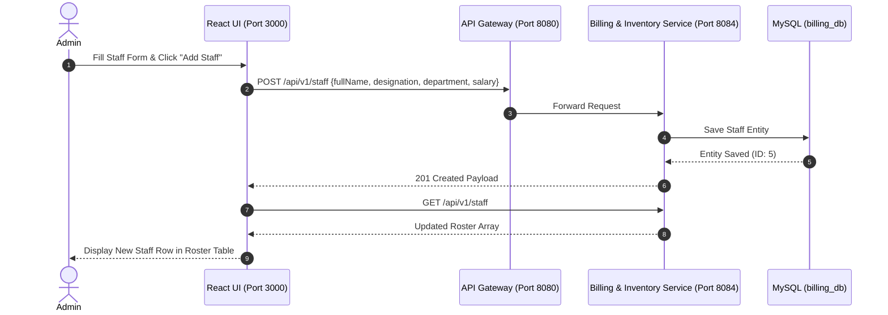

# Figma UX Flow 5: Hospital Administration & Staff Roster Management

> **Figma Board ID**: `FIG-FLOW-05-STAFF`  
> **Route**: `http://localhost:3000/admin` (Tab 1)  
> **Primary Persona**: Administrator (`ROLE_ADMIN`)

---

## 🎨 Figma Board Overview & Interaction Storyboard

This document detail the **Hospital Staff Roster Management** workflow. Hospital administrators onboard medical staff, assign clinical departments (Cardiology, Surgery, Neurology), track designations, and manage monthly payroll rosters.

```
+-----------------------------------------------------------------------------------+
|  STEP 1: Staff Roster Dashboard    --->   STEP 2: Add Staff Form Input            |
|  (Current Personnel Table & Tab 1)         (Name, Designation, Department, Salary)|
|                                                                                   |
|                                         v                                         |
|                                                                                   |
|  STEP 4: Roster Table Updated      <---   STEP 3: POST /api/v1/staff Persistence  |
|  (New Staff Member Persistent Row)        (Database Write to billing_db)          |
+-----------------------------------------------------------------------------------+
```

---

## 📱 Step-by-Step UI Storyboard & Screen Layouts

### Step 1: Staff Roster Dashboard View
- **User Action**: Administrator logs in and opens `/admin`.
- **UI State**: Tab bar with 3 tabs (`Staff Roster`, `Inventory & Medicines`, `Billing & PDF Invoices`). Tab 1 is active.
- **Layout**: 2-Column Responsive Layout.


---

### Step 2: Add Staff Form Input
- **Left Panel — Add Staff Member**:
  - `Full Name`: *Dr. Alan Grant*
  - `Designation`: *Senior Surgeon*
  - `Department`: *Cardiology*
  - `Monthly Salary ($)`: `12000`
- **Trigger**: Clicks `Add Staff` button.

---

### Step 3: Persistence & Service Execution
- **Backend Flow**:
  1. Sent to `billing-inventory-service` (Port 8084) via Gateway (Port 8080).
  2. `POST /api/v1/staff` executes JPA save to MySQL `billing_db`.
  3. Returns `201 Created` with generated Staff ID `#5`.

---

### Step 4: Roster Table Dynamic Update
- **Right Panel — Current Staff Roster Table**:
  - Columns: ID (`#5`), Name (`Dr. Alan Grant`), Designation (`Senior Surgeon`), Department (`Cardiology`), Salary (`$12000` green text).
  - Toast banner displays: *"Added staff member Dr. Alan Grant"*.

---

## 🛠 Microservice Data Flow Sequence



---

## 💬 Live Demo Script
> *"In Flow 5, we see our Staff Roster Management portal. Hospital administrators can onboard new personnel across departments such as Cardiology and Surgery. When we enter staff details and click 'Add Staff', the service persists the record in MySQL and immediately updates our active roster table."*
