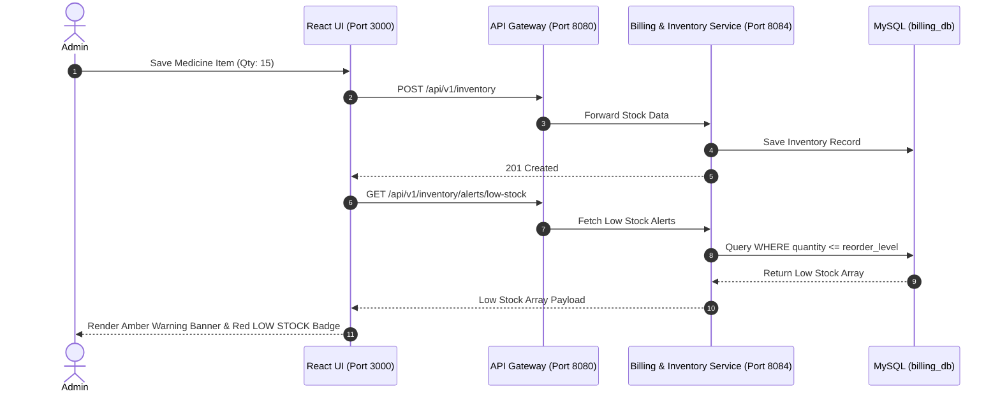

# Figma UX Flow 6: Medical Inventory Control & Automated Low Stock Alert Engine

> **Figma Board ID**: `FIG-FLOW-06-INVENTORY`  
> **Route**: `http://localhost:3000/admin` (Tab 2)  
> **Primary Persona**: Administrator / Procurement Staff

---

## 🎨 Figma Board Overview & Interaction Storyboard

This document detail the **Medical Inventory Control** workflow. The system monitors pharmaceuticals and medical supplies in real time, triggering top-level warning banners and red `LOW STOCK` status chips whenever stock levels fall below reorder thresholds.

```
+-----------------------------------------------------------------------------------+
|  STEP 1: Inventory Tracking Overview --->   STEP 2: Stock Entry below Reorder Level|
|  (Medicine Table & Stock Status Chips)     (Quantity = 15 <= Reorder Level 20)    |
|                                                                                   |
|                                         v                                         |
|                                                                                   |
|  STEP 4: Low Stock Alert Triggered  <---   STEP 3: Automated Audit Calculation    |
|  (Top Amber Warning Alert & Red Badge)     (GET /inventory/alerts/low-stock)      |
+-----------------------------------------------------------------------------------+
```

---

## 📱 Step-by-Step UI Storyboard & Screen Layouts

### Step 1: Inventory Tracking Overview Table
- **User Action**: Administrator clicks `Inventory & Medicines` tab.
- **UI State**: Inventory table listing pharmaceuticals (*Amoxicillin*, *Paracetamol*, *Saline Solution*).
- **Columns**: Item Name, Category, Quantity, Unit Price, Stock Status.


---

### Step 2: Stock Entry below Reorder Threshold
- **Left Panel — Add Inventory Item**:
  - `Item Name`: *Amoxicillin 500mg*
  - `Category`: *Medicine*
  - `Quantity`: `15`
  - `Unit Price ($)`: `12.50`
- **Trigger**: Clicks `Save Stock Item` button.

---

### Step 3: Automated Stock Audit Calculation
- **Backend Flow**:
  1. `POST /api/v1/inventory` saved by `billing-inventory-service` with default `reorderLevel = 20`.
  2. Evaluates condition: `quantity (15) <= reorderLevel (20)` -> Flags item as Low Stock.
  3. `GET /api/v1/inventory/alerts/low-stock` fetches low stock array.

---

### Step 4: Low Stock Alert Triggered
- **UI State**:
  - Top Alert Banner appears: *"Low Stock Warning: 2 inventory items are below reorder threshold!"*
  - Amoxicillin table row highlights a prominent red Chip: `LOW STOCK`.

---

## 🛠 Microservice Data Flow Sequence



---

## 💬 Live Demo Script
> *"In Flow 6, we demonstrate automated Inventory Control. Each pharmaceutical item has a reorder threshold. When an item's stock drops below this threshold—for instance, Amoxicillin with 15 units against a reorder level of 20—the system instantly flags the row with a red 'LOW STOCK' badge and generates a top-level alert for procurement!"*
