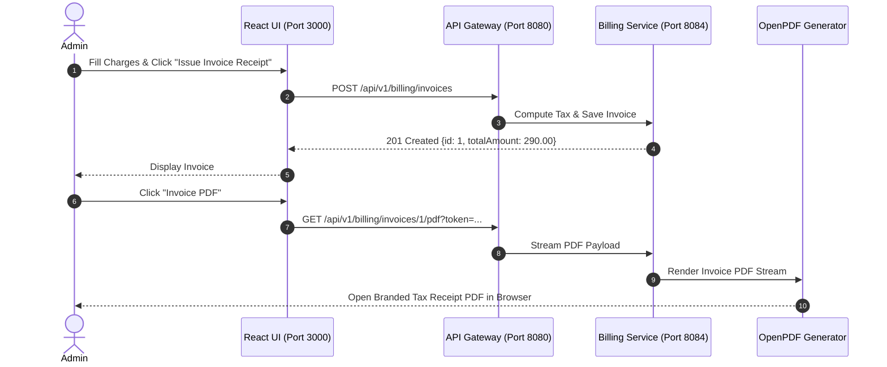

# Figma UX Flow 7: Financial Billing Ledger & PDF Invoice Receipts

> **Figma Board ID**: `FIG-FLOW-07-BILLING`  
> **Route**: `http://localhost:3000/admin` (Tab 3)  
> **Primary Persona**: Administrator / Billing Clerk

---

## 🎨 Figma Board Overview & Interaction Storyboard

This document detail the **Financial Billing Ledger & Invoice Generation** workflow. Administrators enter itemized charges for consultation, pharmacy, and laboratory services. The system computes taxes, persists invoice ledgers, and generates PDF receipts via OpenPDF.

```
+-----------------------------------------------------------------------------------+
|  STEP 1: Invoice Generator Form Input --->   STEP 2: Automated Tax Calculation    |
|  (Consultation $150, Meds $45, Lab $80)     (Tax $15 -> Total Amount $290.00)     |
|                                                                                   |
|                                         v                                         |
|                                                                                   |
|  STEP 4: OpenPDF Tax Receipt Download <---   STEP 3: Ledger Table Record Created  |
|  (Itemized PDF Invoice Byte Stream)       (Invoice #INV-1 with PAID Status Chip)  |
+-----------------------------------------------------------------------------------+
```

---

## 📱 Step-by-Step UI Storyboard & Screen Layouts

### Step 1: Invoice Generator Form Input
- **User Action**: Administrator selects `Billing & PDF Invoices` tab.
- **Left Panel — Generate Patient Invoice**:
  - `Consultation Fee ($)`: `150`
  - `Medicine Charges ($)`: `45`
  - `Lab Test Charges ($)`: `80`
- **Trigger**: Clicks `Issue Invoice Receipt` button.


---

### Step 2: Automated Tax & Total Calculation
- **Backend Calculation**:
  - `Subtotal` = 150 + 45 + 80 = $275.00
  - `Tax Amount` = $15.00
  - `Total Amount` = $290.00
- **Database Write**: `billing-inventory-service` persists record in `billing_db` under `PAID` status.

---

### Step 3: Ledger Table Record Created
- **Right Panel — Billing Ledger & PDF Receipts Table**:
  - `Invoice #`: `#INV-1` (Cyan highlighted link)
  - `Patient`: `John Doe`
  - `Total Amount`: `$290.00` (Bold green text)
  - `Status`: `PAID` (Green chip)
  - `Action`: `Invoice PDF` (Red outline button)

---

### Step 4: OpenPDF Tax Receipt Export
- **User Action**: Clicks `Invoice PDF` button.
- **Browser Execution**: Opens new secure window:
  `http://localhost:8080/api/v1/billing/invoices/1/pdf?token={jwt}`
- **OpenPDF Output**: Streams official itemized hospital tax invoice PDF with header logo, patient breakdown, subtotal, tax, total, and authorization signature.

---

## 🛠 Microservice Data Flow Sequence



---

## 💬 Live Demo Script
> *"Finally, in Flow 7, we have the Billing Ledger. Administrators input consultation, pharmacy, and laboratory fees. When we issue an invoice, the system computes taxes and total amounts. Clicking 'Invoice PDF' calls OpenPDF through Spring Gateway to stream an official, itemized hospital receipt!"*
